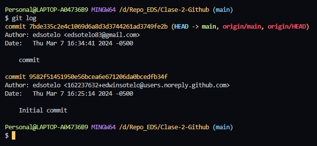
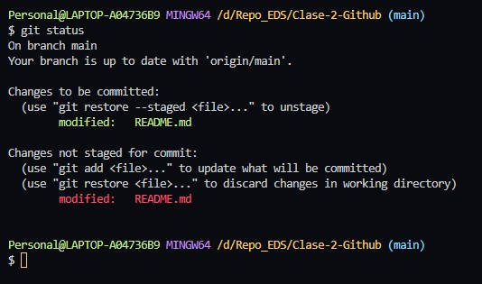
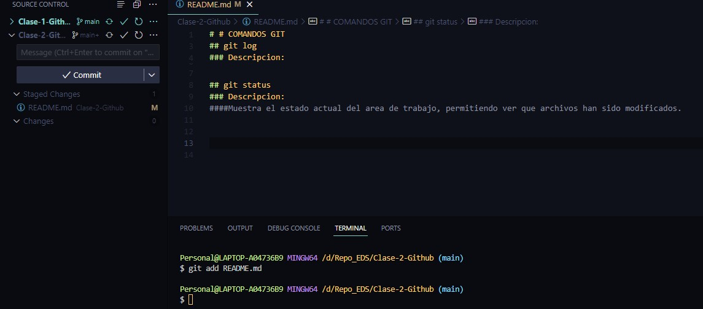
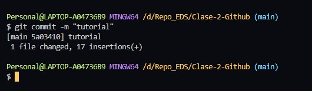
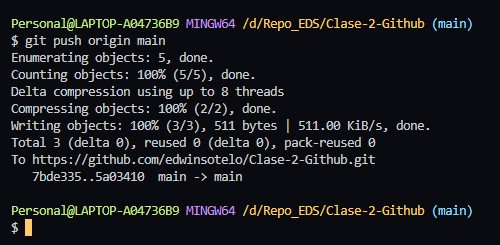
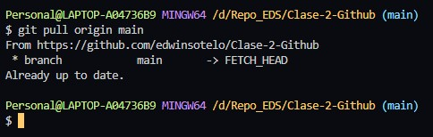

# COMANDOS GIT

# git log
## Descripcion: 
*permite visualizar el historial de los commit con el fin de buscar cambios específicos.*
 

## git status
Descripcion:
*Muestra el estado actual del area de trabajo, permitiendo ver que archivos han sido modificados.*

## git add
## Descripcion:
####*Añade una modificación presente en el working directory al staging area.*

## git commit -m
### Descripcion:
####*Permite nombrar los cambios preparados en ese momento del proyecto.*

## git push
### Descripcion:
####*Permite subir el contenido de un repositorio local a un repositorio central.*

## git pull
### Descripcion:
####*Permite sbajar el contenido de un repositorio central a un repositorio local.*

